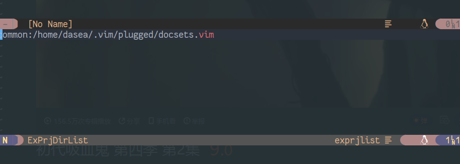

# ex-prjlist
1. 列出你已经创建的exvim工程(List your exvim project)
2. 通过`EXPrjDirSave`保存常用文件夹，通过`EXPrjCommonDirList`查看已经保存的文件夹
3. 通过`EXPrjVerDisList`显示`g:exprjlist_vsc_root_dir`设置的版本控制的项目列表
4. 通过`EXPrjPlugDirList`显示vim/neovim的插件文件夹列表

## 安装(install)
由于你使用时可能已经有ex-utility插件了, 最好用我fork的替代exvim的, 由于我添加了一些函数,
但是没有添加到主分支里面。

### Vundle.vim
```
Plugin 'DaSea/ex-utility'
Plugin 'DaSea/ex-prjlist'
```

### vim-plug
```
Plug 'DaSea/ex-utility'
Plug 'DaSea/ex-prjlist'
```

## 快捷键(key mapping)
1. 打开工程列表窗口: <leader>el;
2. 在工程列表窗口时: 按j, k 可以上下选择, 按下<enter>可以打开工程;
3. 按下dd可以删除工程, 包括删除工程文件和工程文件夹;

## 变量设置
1. `g:exprjlist_cache_directory` 存放缓存的地方，默认值是`~/.cache`;
2. `g:exprjlist_vsc_root_dir` 版本控制目录，默认为空，参考设置:

```vim
let g:exprjlist_vsc_root_dir = {"/media/work/Self/05_gitsrc": "git"}
```

3. `g:exprjlist_vimplug_root_dir` vim/neovim的插件目录, 默认值:

```vim
let g:exprjlist_vimplug_root_dir = "~/.vim/plugged"
```

## 运行截图
1. 插件列表


2. exvim项目工程列表与普通文件夹列表



3. 版本控制工程列表


